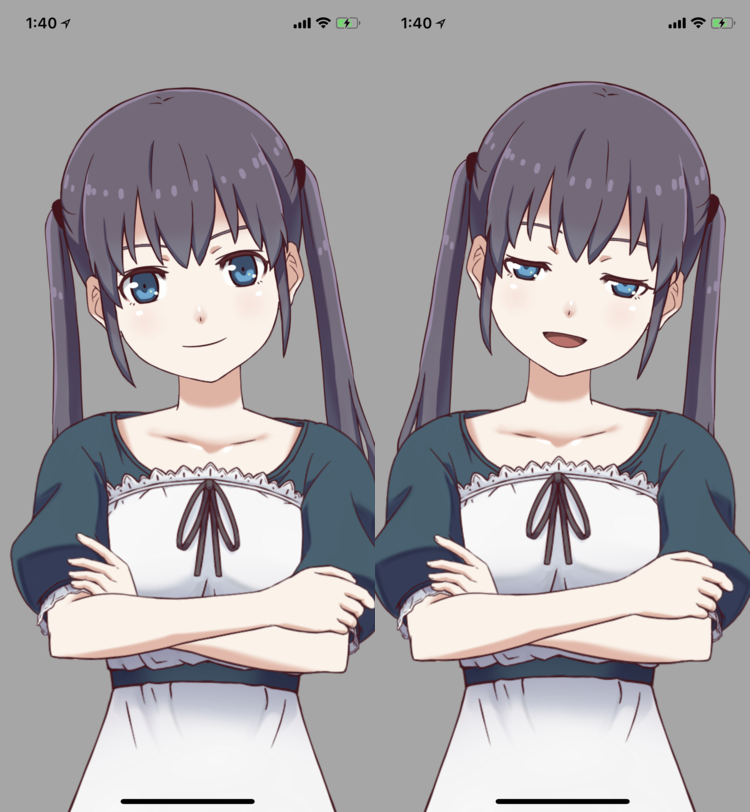

#  ARKit-Live2D
Live2D face motion control with ARKit face tracking sample

## Implementations

- iPhone X ARKit Face tracking
- Live2D Cubism 4.0 Face motion control
- ReplayKit Live broadcasting

## Requirements

- [iPhone and iPad models that support Face ID](https://support.apple.com/HT209183)
  - iOS 13.2 or higher version
- Xcode 11.3

## Preparation

0. Clone this repository with `--recursive`.
1. Get Live2D Cubism SDK 2 from [here](https://www.live2d.com/download/cubism-sdk/download-native/). **Tested version: Cubism 4 SDK for Native R1**
2. Unarchive the sdk and put *include* and *lib* directories into root directory of this repository.

## Build

1. Set code signing team.
2. Build App.

## License

### Source Code
[Modified BSD 3-clause License](LICENSE)

### Cubism Native Framewoork

* [Live2D Open Software License Agreement](https://www.live2d.com/eula/live2d-open-software-license-agreement_en.html)
* [Live2D Open Software 使用許諾契約書](https://www.live2d.com/eula/live2d-open-software-license-agreement_jp.html)

### Model Data

https://www.live2d.com/download/sample-data/

一般ユーザーおよび小規模事業者は規約同意により商用利用可能。
中・大規模事業者は非公開テスト用途での利用のみ。
ご利用に際しては『[無償提供マテリアルの使用許諾契約書](https://www.live2d.jp/en/terms/live2d-free-material-license-agreement/)』（ライセンスタイプ ・Live2Dオリジナルキャラクター）およびこちらの[利用条件](http://bit.ly/l2dhiyori)への同意が必要です。

[Live2D Original Character License](https://www.live2d.jp/en/terms/live2d-free-material-license-agreement/)

> 2.1.3 Live2D Original Character License
>
> The Customer, as long as the Customer complies with terms and conditions for utilizing each Live2D Original Character described in each down load page thereof, is licensed to use, alter and Distribute Live2D Original Character for Purpose of Use only. Unless expressly permitted, the Customer may not use, or Distribute or Redistribute alternation of, the sound data included in the Material. When the Customer has downloaded each Live2D Original Character, the Customer shall be deemed to have understood and agreed with whole of the terms and condition for utilizing the Live2D Original Character and this Agreement.

> 2.1.3 Live2Dオリジナルキャラクターライセンス
>
> お客様は、各Live2Dオリジナルキャラクターのダウンロードページに記載された利用条件に従う場合に限り、本契約に記載の使用等目的の用途に従って、Live2Dオリジナルキャラクターを使用、改変し、また配布することができます。また明示的に許可された場合を除き、本マテリアルに含まれる音声データについては、これを使用、改変して配布したり、再配布することはできません。お客様は、各Live2Dオリジナルキャラクターをダウンロードすることにより、ダウンロードページに記載された利用条件および本契約を理解し、その条件にすべて合意したとみなされます。

